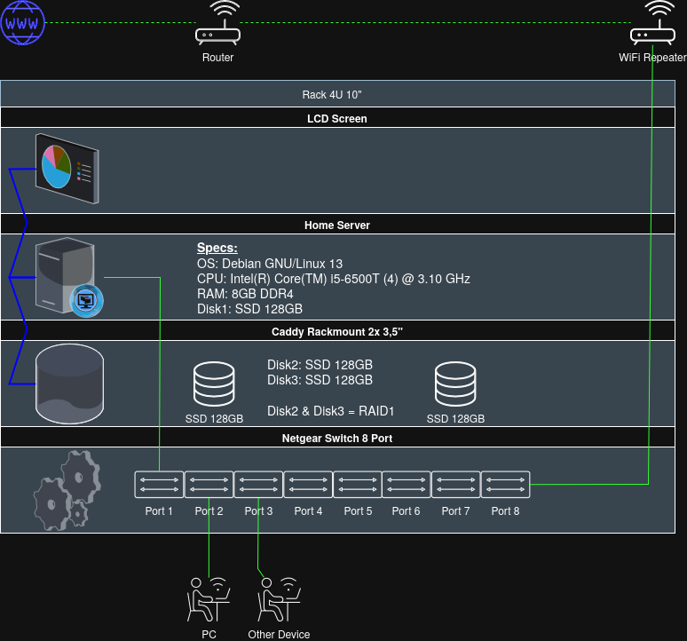

# 🏠 Home-Server Stack – Knuspii
A self-hosted home server setup running on Debian with Docker Compose. \
I mainly use this for Taskmanagement, Backups and DNS Adblock.

---

<div align="center">

</div>

---

## Selfhosted Apps
| Service | Description |
|--------|-------------|
| 🧠 Glance | Dashboard |
| 🌐 AdGuard Home | DNS Adblock |
| 📁 Filebrowser | File Management |
| 💰 Wallos | Finance Tracking |
| ✅ Vikunja | Task Management |
| 📧 Mailrise | Pass Mails |
| 📡 Glances | Monitoring |
| 🧪 TTYD | Shell Testing |
| 📦 minecraft-srv | Minecraft Server |

## Scripts
| Script | Purpose |
|--------|---------|
| cleanup.sh | System cleanup |
| backup.sh | Backups (private) |
| check_smartctl.sh | Disk health check |
| check_docker.sh | Docker health check |
| send_pushover.sh | Send messages to myself via Pushover (private) |

---

## ⚙️ System Setup (Debian)
### Base packages I use
```bash
sudo apt install htop ssh rsync ncdu curl tree jq smartmontools fastfetch at mdadm
```

## 📊 Notes
- Designed for local network use
- Secrets are stored in `.env` (not committed obviously)

---

## 🧠 Author
Home server stack by Knuspii
